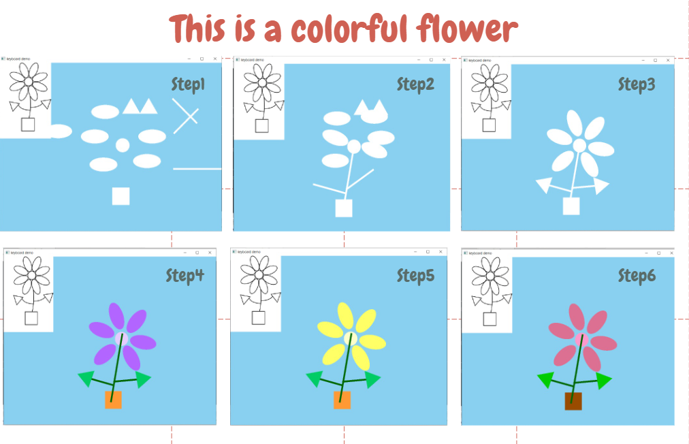
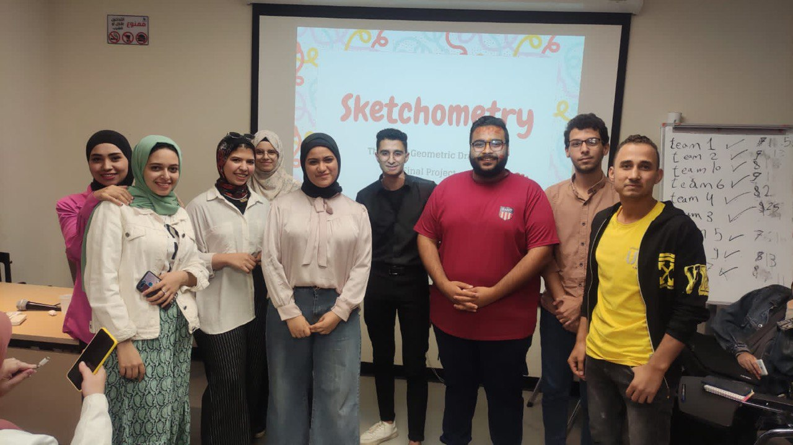

# Sketchometry: (The Art of Geometric Drawing)

 

## About our project:
this project is a simple game for children (4-10 years) that aims to teach them how to draw simple drawings using basic geometric shapes mainly circles, ellipses, rectangles, and triangles, as well as teach them how to choose colors for their drawings through preprepared beautiful color pallets. 
 
We designed our game to be kids friendly and to suit children from 4 to 10 years using beautiful colors and cheerful music.

## Game Rules and Instructons:
-  User Select the drawing he wish to draw 

- The required geometric shapes to create the drawing will appear randomly

- The user can freely move or  the geometric shapes to arrange them in the correct order 

- Finally the user can apply multiple pallets of colors to get inspiration of how colors fit with each other. 

# a glimpse of our game:

  

# meet the team:

